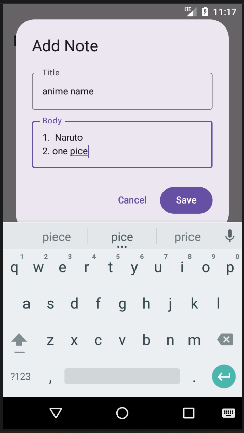

# 📝 Notes App

A simple Notes application built using **Kotlin** and **Jetpack Compose**.  
This project demonstrates modern Android development with MVVM architecture and state management.

---

## 🚀 Features
- Add new notes
- Display notes in a list
- Dialog-based input
- MVVM architecture
- Built with Jetpack Compose

---

## 🛠 Tech Stack
- Kotlin
- Jetpack Compose
- ViewModel
- StateFlow
- Material 3

---

## ▶️ How to Run

1. Clone the repository:
   ```bash
   git clone  https://github.com/Harshbadoliya/NotesApp.git
2. Open in Android Studio
3. Wait for Gradle sync
4. Run on emulator or device


----

## 📸 Screenshots

### Home Screen


### Add Note Dialog


### Notes List


